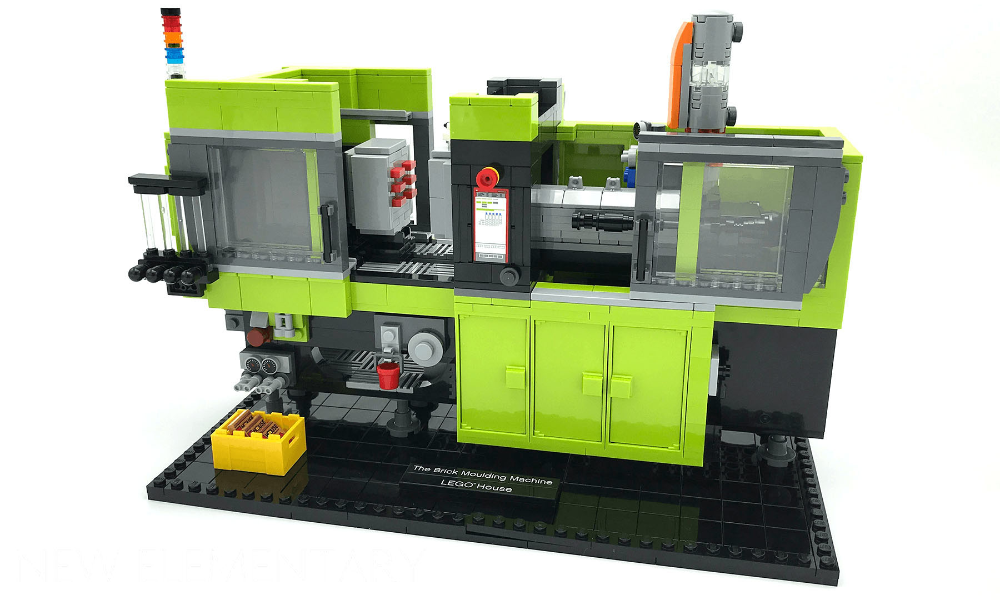
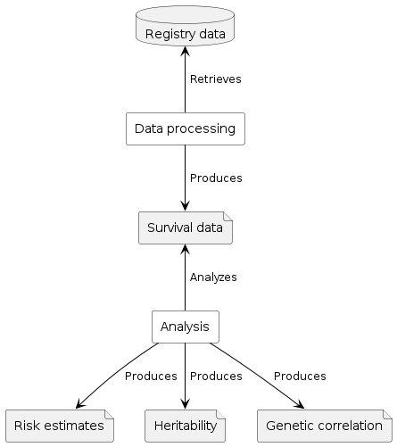

# -*- org-confirm-babel-evaluate: nil -*-
#+OPTIONS: ^:nil
#+OPTIONS: html-postamble:nil
#+LANGUAGE: en-us
#+HTML_DOCTYPE: html5
#+HTML_HEAD: <link rel="stylesheet" type="text/css" href="http://www.pirilampo.org/styles/readtheorg/css/htmlize.css"/>
#+HTML_HEAD: <link rel="stylesheet" type="text/css" href="http://www.pirilampo.org/styles/readtheorg/css/readtheorg.css"/>
#+HTML_HEAD: 
#+LATEX_CLASS: article
#+LATEX_CLASS_OPTIONS: [a4paper,12pt]
#+LATEX_HEADER: \usepackage[swedish]{babel}
#+LATEX_HEADER: \renewcommand{\familydefault}{\sfdefault}
#+LATEX_HEADER: \usepackage{background}
#+LATEX_HEADER: \usepackage{helvet}
#+LATEX_HEADER: \usepackage[margin=1in]{geometry}
#+LATEX_HEADER: \usepackage{parskip}
#+LATEX_HEADER: \usepackage{tabularx}
#+LATEX_HEADER: \usepackage{float}
#+LATEX_HEADER: \usepackage{color}
#+LATEX_HEADER: \usepackage{titlesec}
#+LATEX_HEADER: \usepackage{listings}
#+LATEX_HEADER: \usepackage[utf8]{inputenc}
#+LATEX_HEADER: \usepackage[document]{ragged2e}
#+LATEX_HEADER: \usepackage[T1]{fontenc}
#+LATEX_HEADER: \usepackage{sectsty}
#+LATEX_HEADER: \usepackage[most]{tcolorbox}
#+LATEX_HEADER: \definecolor{light_grey}{RGB}{51,51,51}
#+LATEX_HEADER: \definecolor{bright_grey}{RGB}{249,249,249}
#+LATEX_HEADER: \definecolor{python_blue}{RGB}{41,128,185}
#+LATEX_HEADER: \titleformat*{\section}{\LARGE\bfseries}
#+LATEX_HEADER: \titleformat*{\subsection}{\Large\bfseries}
#+LATEX_HEADER: \titleformat*{\subsubsection}{\large\bfseries}
#+LATEX_HEADER: \titleformat*{\paragraph}{\large\bfseries}
#+LATEX_HEADER: \titleformat*{\subparagraph}{\large\bfseries}
#+LATEX_HEADER: \renewcommand{\baselinestretch}{1.2}
#+LATEX_HEADER: \hypersetup{colorlinks=true, urlcolor=python_blue, linkcolor=python_blue, citecolor=red}
#+LATEX_HEADER: \sectionfont{\color{light_grey}}
#+LATEX_HEADER: \subsectionfont{\color{light_grey}}
#+LATEX_HEADER: \tolerance=1
#+LATEX_HEADER: \emergencystretch=\maxdimen
#+LATEX_HEADER: \hyphenpenalty=10000
#+LATEX_HEADER: \hbadness=10000
#+LATEX_HEADER: \makeatletter
#+LATEX_HEADER: \renewenvironment{quote}{%
#+LATEX_HEADER:   \tcolorbox[
#+LATEX_HEADER:     top=10pt,
#+LATEX_HEADER:     bottom=10pt
#+LATEX_HEADER:   ]
#+LATEX_HEADER:   \parskip=0.5\baselineskip \advance\parskip by 0pt plus 2pt
#+LATEX_HEADER:   \parindent=0pt
#+LATEX_HEADER: }{%
#+LATEX_HEADER:   \endtcolorbox
#+LATEX_HEADER: }
#+LATEX_HEADER: \makeatother
#+LATEX_HEADER: \definecolor{light-gray}{gray}{0.95}
#+LATEX_HEADER: \lstset{
#+LATEX_HEADER:   xleftmargin=0.5cm,frame=tlbr,framesep=4pt,framerule=0pt,
#+LATEX_HEADER:   columns=fullflexible,
#+LATEX_HEADER:   backgroundcolor=\color{light-gray},
#+LATEX_HEADER:   basicstyle=\footnotesize\ttfamily,
#+LATEX_HEADER:   breakatwhitespace=false,
#+LATEX_HEADER:   breaklines=true,
#+LATEX_HEADER:   frame=single,
#+LATEX_HEADER:   keepspaces=true,
#+LATEX_HEADER:   rulecolor=\color{black},
#+LATEX_HEADER:   showspaces=false,
#+LATEX_HEADER:   showstringspaces=false,
#+LATEX_HEADER:   showtabs=false,
#+LATEX_HEADER:   stepnumber=2,
#+LATEX_HEADER:   tabsize=2,
#+LATEX_HEADER: }
#+LATEX: \color{light_grey}
#+LATEX: \frenchspacing
#+LATEX: \raggedright
#+TITLE: IBP Registry Risk Estimations
#+AUTHOR: Richard Zetterberg <richard.zetterberg@regionh.dk>

~ibp-risk-estimations~ is an R package that is a box of parts that can be assembled
into complete risk estimation, heritability and genetic correlation pipelines.

But, in order to make it faster to get going, this package also includes pre-assembled pipelines.

These are the included pipelines:

- [[./docs/pipelines/estimate_cumulative_incidence_of_disorder.org][Estimate cumulative incidence of disorder]]
- [[./docs/pipelines/estimate_heritability_of_disorder.org][Estimate heritability of disorder]]
- [[./docs/pipelines/estimate_heritability_of_disorder_by_yob.org][Estimate heritability of disorder stratified by birth year]]
- [[./docs/pipelines/estimate_genetic_correlation_between_two_disorders.org][Estimate genetic correlation between two disorders]]
- [[./docs/pipelines/estimate_genetic_correlation_between_two_disorders_by_yob.org][Estimate genetic correlation between two disorders stratified by birth year]]

See the [[Terminology][Terminology]] chapter for the definition of all the terms used in this documentation.

* How it works

The anatomy of a assembled pipeline can be divided into 3 distinct parts:

- Data processing :: Producing survival data from registry data
- Analysis :: Producing risk estimates, heritability and genetic correlations from survival data
- Plotting :: Producing plots from analysis results

#+LATEX: \vspace{0.5cm}
#+LATEX: \begin{center}
#+NAME: fig:domain-model
#+ATTR_HTML: :style max-width: 100%;
#+BEGIN_SRC plantuml :file ./docs/diagrams/domain-model.png :exports results
@startuml
!include ./docs/diagrams/archimate.puml

database "Registry data" as registry_data
file "Survival data" as tte_data
Rectangle(data_processing, "Data processing")

Rectangle(analysis, "Analysis")
file "Risk estimates" as estimates
file "Heritability" as heritability
file "Genetic correlation" as genetic_correlation

data_processing -UP-> registry_data : " Retrieves"
data_processing --> tte_data : " Produces"
analysis -UP-> tte_data : " Analyzes"
analysis --> estimates : " Produces"
analysis --> heritability : " Produces"
analysis --> genetic_correlation : " Produces"
@enduml
#+END_SRC

#+ATTR_LATEX: :placement [H]
#+CAPTION: Domain model
#+RESULTS: fig:domain-model

* Terminology

** Registry data

"Registry data", or "register data", represents raw data from national registries,
such as:

- Civil records
- Medical records (hospital visits and diagnoses)
- Birth metrics
- Residential records

This data come in a variaty of different formats depending on which country the
data came from, some national registries even have different formats in different
time periods of the same data.

** Survival data

"Survival data", also called "TTE (time to event) data", represents the outcomes of a
disorder in a population over a period of time. An example of this could be survival
data for a study of "ADHD in the general population in the period 1987 to 2017".

Survival data is tabular and each row represents a distinct individual in the studied
population and must contain at least these 3 columns:

|-------------------+----------------------------------------------------------------------------------------------------|
| Column            | Description                                                                                        |
|-------------------+----------------------------------------------------------------------------------------------------|
| Unique identifier | An combination of letters/numbers that uniquely identifies a distinct individual in the population |
| [[Failure status][Failure status]]    | Study outcome for the individual, 0 = censored, 1 = affected, 2 = competing risk                   |
| Failure time      | Age (in years) of the individual when the outcome occured                                          |
|-------------------+----------------------------------------------------------------------------------------------------|

Somtimes other columns are included, such as birth date, sex, number of affected relatives, etc.

** Risk estimates

"Risk estimates" represents

** Failure status

"Failure status" (or "survival status") represents the outcome an individual had
when studing a disorder/disease over a period of time. There are 3 possible
outcomes:

|----------------+-------|
| Event          | Value |
|----------------+-------|
| Censored       |     0 |
| Affected       |     1 |
| Competing risk |     2 |
|----------------+-------|

These are the different scenarios that leads to the different outcomes:

- Censored
  - Uncertain/insufficient data
    - The person went missing
    - The person was removed from the registry
    - The person emigrated
  - The person survived the whole period without being diagnosed
- Affected
  - The person was diagnosed with the disorder
- Competing risk
  - The person died

Note that some studies define competing risk and censoring differently.
In some studies emigration is defined as "competing risk" instead of "censoring".

* Equations                                                        :noexport:

** h2

#+BEGIN_SRC R
num  = T1-Tr * sqrt(1 - (1 - T1/i) * (T1^2 -Tr^2))
den  = ar * (i + (i-T1)*Tr^2)
h2   = num/den
#+END_SRC

\begin{equation}
h^2 = \frac{
  T - T_R \sqrt{1 - (1 - T/i) (T^2 - T_R^2)}
}{
  a_R (i + (i-T)T_R^2)
}
\end{equation}

** s.e. h2

#+BEGIN_SRC R
h2.calculation = function(K1,Kr,A1,Ar,ar=1/2)
{
	# h2 estimate
	T1   = qnorm(K1, lower.tail= FALSE) # lifetime prevalence unaffected/general population represeting the upper tail z value
	y    = dnorm(T1)
	i    = y/K1
	Tr   = qnorm(Kr, lower.tail= FALSE) # lifetime prevalence in the relatives of the affected ones represeting the upper tail z value
	yr   = dnorm(Tr)

	num  = T1-Tr * sqrt(1 - (1 - T1/i) * (T1^2 -Tr^2))
	den  = ar * (i + (i-T1)*Tr^2)
	h2   = num/den
	# se estimation
	Wg   = (((K1^2)/(y^2)) * (1-K1)) / A1
	vvg  = (1/i - ar*h2*(i-T1))^2 # there is a + in Wray and a - in Falconer
	Wr   = Kr^2/yr^2 * (1-Kr) / Ar
	vvr  = (1/i)^2

	se   = 1/ar * sqrt(vvg * Wg + vvr * Wr)
	#se   = 1/ar * sqrt(vvg * Wg + vvr * Wr)
	ci.l = h2 - 1.96 * se
	ci.u = h2 + 1.96 * se
	output = rbind(c(h2, se, ci.l, ci.u))
	colnames(output) = c("h2", "se", "L95", "U95")
	return(output)
}
#+END_SRC

\begin{equation}
vvg = (\frac{1}{i} - a_R h2 (i - T))^2 \\
Wg = (\frac{K^2}{y^2} (1-K)) / A \\
vvr = (\frac{1}{i})^2 \\
Wr = \frac{K_R^2}{y_R^2} (1 - K_R) / A_R \\

s.e(h2) = \frac{1}{a_R} \sqrt{
  vvg WG + vvr Wr
}
\end{equation}

** rg

** s.e. rg

* Todo

- [ ] Add simpler summary function that can show comorbidity of two disorders
- [ ] Add formatting functions the different formats
