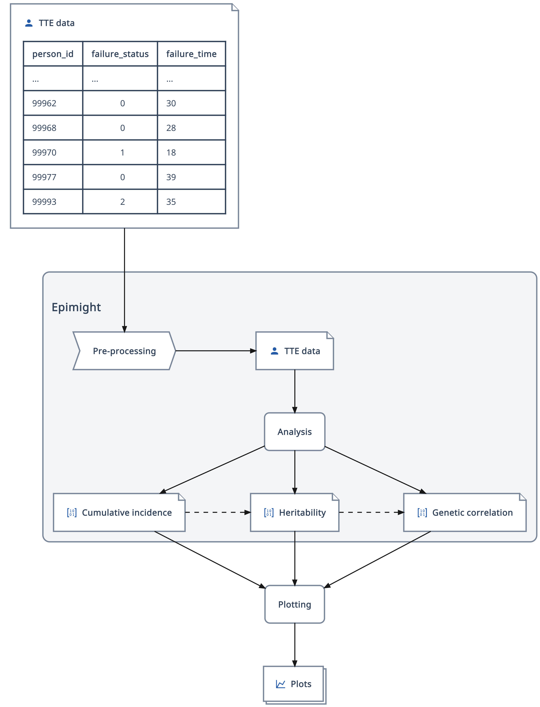
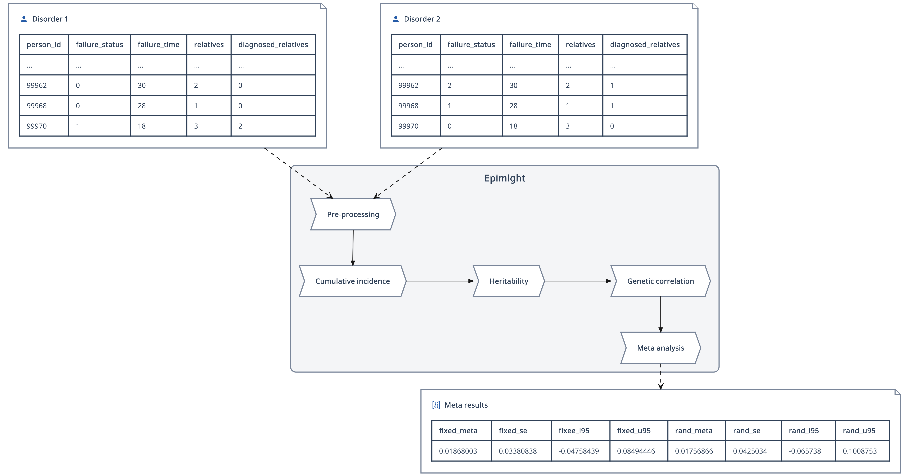

# -*- org-confirm-babel-evaluate: nil -*-
#+OPTIONS: ^:nil
#+OPTIONS: html-postamble:nil
#+LANGUAGE: en-us
#+LATEX_CLASS: article
#+LATEX_CLASS_OPTIONS: [a4paper,12pt]
#+LATEX_HEADER: \usepackage[swedish]{babel}
#+LATEX_HEADER: \renewcommand{\familydefault}{\sfdefault}
#+LATEX_HEADER: \usepackage{background}
#+LATEX_HEADER: \usepackage{helvet}
#+LATEX_HEADER: \usepackage[margin=1in]{geometry}
#+LATEX_HEADER: \usepackage{parskip}
#+LATEX_HEADER: \usepackage{tabularx}
#+LATEX_HEADER: \usepackage{float}
#+LATEX_HEADER: \usepackage{color}
#+LATEX_HEADER: \usepackage{titlesec}
#+LATEX_HEADER: \usepackage{listings}
#+LATEX_HEADER: \usepackage[utf8]{inputenc}
#+LATEX_HEADER: \usepackage[document]{ragged2e}
#+LATEX_HEADER: \usepackage[T1]{fontenc}
#+LATEX_HEADER: \usepackage{sectsty}
#+LATEX_HEADER: \usepackage[most]{tcolorbox}
#+LATEX_HEADER: \definecolor{light_grey}{RGB}{51,51,51}
#+LATEX_HEADER: \definecolor{bright_grey}{RGB}{249,249,249}
#+LATEX_HEADER: \definecolor{python_blue}{RGB}{41,128,185}
#+LATEX_HEADER: \titleformat*{\section}{\LARGE\bfseries}
#+LATEX_HEADER: \titleformat*{\subsection}{\Large\bfseries}
#+LATEX_HEADER: \titleformat*{\subsubsection}{\large\bfseries}
#+LATEX_HEADER: \titleformat*{\paragraph}{\large\bfseries}
#+LATEX_HEADER: \titleformat*{\subparagraph}{\large\bfseries}
#+LATEX_HEADER: \renewcommand{\baselinestretch}{1.2}
#+LATEX_HEADER: \hypersetup{colorlinks=true, urlcolor=python_blue, linkcolor=python_blue, citecolor=red}
#+LATEX_HEADER: \sectionfont{\color{light_grey}}
#+LATEX_HEADER: \subsectionfont{\color{light_grey}}
#+LATEX_HEADER: \tolerance=1
#+LATEX_HEADER: \emergencystretch=\maxdimen
#+LATEX_HEADER: \hyphenpenalty=10000
#+LATEX_HEADER: \hbadness=10000
#+LATEX_HEADER: \makeatletter
#+LATEX_HEADER: \renewenvironment{quote}{%
#+LATEX_HEADER:   \tcolorbox[
#+LATEX_HEADER:     top=10pt,
#+LATEX_HEADER:     bottom=10pt
#+LATEX_HEADER:   ]
#+LATEX_HEADER:   \parskip=0.5\baselineskip \advance\parskip by 0pt plus 2pt
#+LATEX_HEADER:   \parindent=0pt
#+LATEX_HEADER: }{%
#+LATEX_HEADER:   \endtcolorbox
#+LATEX_HEADER: }
#+LATEX_HEADER: \makeatother
#+LATEX_HEADER: \definecolor{light-gray}{gray}{0.95}
#+LATEX_HEADER: \lstset{
#+LATEX_HEADER:   xleftmargin=0.5cm,frame=tlbr,framesep=4pt,framerule=0pt,
#+LATEX_HEADER:   columns=fullflexible,
#+LATEX_HEADER:   backgroundcolor=\color{light-gray},
#+LATEX_HEADER:   basicstyle=\footnotesize\ttfamily,
#+LATEX_HEADER:   breakatwhitespace=false,
#+LATEX_HEADER:   breaklines=true,
#+LATEX_HEADER:   frame=single,
#+LATEX_HEADER:   keepspaces=true,
#+LATEX_HEADER:   rulecolor=\color{black},
#+LATEX_HEADER:   showspaces=false,
#+LATEX_HEADER:   showstringspaces=false,
#+LATEX_HEADER:   showtabs=false,
#+LATEX_HEADER:   stepnumber=2,
#+LATEX_HEADER:   tabsize=2,
#+LATEX_HEADER: }
#+LATEX: \color{light_grey}
#+LATEX: \frenchspacing
#+LATEX: \raggedright
#+TITLE: Architecture
#+AUTHOR: Richard Zetterberg <richard.zetterberg@regionh.dk>

#+LATEX: \vspace{0.5cm}
#+LATEX: \begin{center}
#+NAME: fig:package-scope
#+ATTR_HTML: :style max-width: 100%;
#+BEGIN_SRC plantuml :file ./diagrams/package-scope.png :exports results
@startuml
!include <material/account>
!include <material/account_search>
!include <material/chart_line>
!include <material/data>
!include <material/database>
!include <material/matrix>
!include ./diagrams/ibp.puml

file tte [
<color:#255ba7><$ma_account{scale=0.35}></color>  **TTE data**

| **person_id** | **failure_status** | **failure_time** |
| ...           | ...                | ...              |
| 99962         |              0     | 30               |
| 99968         |              0     | 28               |
| 99970         |              1     | 18               |
| 99977         |              0     | 39               |
| 99993         |              2     | 35               |
]

Boundary1(scope, "Epimight") {
  Process(data_processing, "**Pre-processing**")
  File(tte_data, "<color:#255ba7><$ma_account{scale=0.35}></color>  **TTE data**")
  Rectangle(analysis, "**Analysis**")
  File(estimates, "<color:#255ba7><$ma_matrix{scale=0.35}></color>  **Cumulative incidence**")
  File(heritability, "<color:#255ba7><$ma_matrix{scale=0.35}></color>  **Heritability**")
  File(genetic_correlation, "<color:#255ba7><$ma_matrix{scale=0.35}></color>  **Genetic correlation**")
}

Rectangle(plotting, "**Plotting**")
Collection(plots, "<color:#255ba7><$ma_chart_line{scale=0.35}></color>  **Plots**")

Arrow_Down(tte, data_processing)
Arrow_Right(data_processing, tte_data)
Arrow_Down(tte_data, analysis)
Arrow_Down(analysis, estimates)
Arrow_Down(analysis, heritability)
Arrow_Down(analysis, genetic_correlation)

estimates .RIGHT.>> heritability
heritability .RIGHT.>> genetic_correlation

Arrow_Down(estimates, plotting)
Arrow_Down(heritability, plotting)
Arrow_Down(genetic_correlation, plotting)
Arrow_Down(plotting, plots)
@enduml
#+END_SRC

#+ATTR_LATEX: :placement [H]
#+CAPTION: Package scope
#+RESULTS: fig:package-scope

file:./diagrams/package-scope.png

#+LATEX: \begin{center}
#+NAME: pipeline-component-diagram
#+BEGIN_SRC plantuml :file ./diagrams/pipeline-component-diagram.png :exports results
@startuml
skinparam dpi 300
skinparam shadowing false
skinparam padding 5
skinparam nodesep 80
skinparam ranksep 80
skinparam defaultTextAlignment left
skinparam noteTextAlignment left

file "Time to event" as tte

component "epimight" as epimight {
  process "Data\nprocessing" as data_processing
  process "Cumulative\nincidence" as cif1
  process "Heritability" as h2
  process "Genetic\ncorrelation" as gc
  process "Meta\nanalysis" as meta
}

tte .RIGHT.> data_processing
data_processing -RIGHT-> cif1
cif1 -RIGHT-> h2
h2 -RIGHT-> gc
gc -RIGHT-> meta

@enduml
#+END_SRC

#+ATTR_LATEX: :placement [H] :width \textwidth
#+RESULTS: pipeline-component-diagram

#+LATEX: \end{center}
