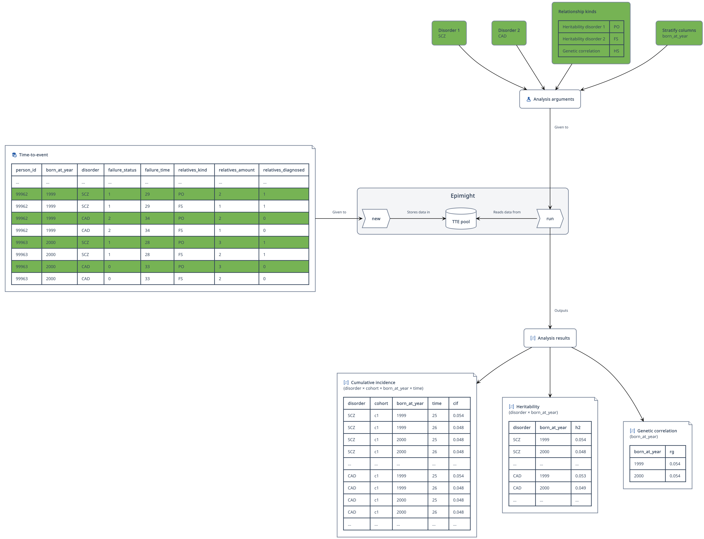
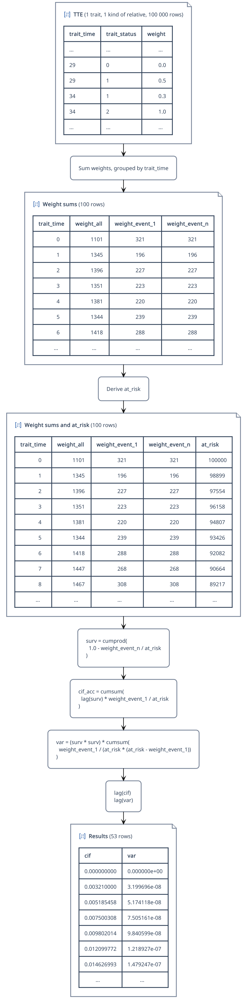

# -*- org-confirm-babel-evaluate: nil -*-
#+OPTIONS: ^:nil
#+OPTIONS: html-postamble:nil
#+LANGUAGE: en-us
#+LATEX_CLASS: article
#+LATEX_CLASS_OPTIONS: [a4paper,12pt]
#+LATEX_HEADER: \usepackage[swedish]{babel}
#+LATEX_HEADER: \renewcommand{\familydefault}{\sfdefault}
#+LATEX_HEADER: \usepackage{background}
#+LATEX_HEADER: \usepackage{helvet}
#+LATEX_HEADER: \usepackage[margin=1in]{geometry}
#+LATEX_HEADER: \usepackage{parskip}
#+LATEX_HEADER: \usepackage{tabularx}
#+LATEX_HEADER: \usepackage{float}
#+LATEX_HEADER: \usepackage{color}
#+LATEX_HEADER: \usepackage{titlesec}
#+LATEX_HEADER: \usepackage{listings}
#+LATEX_HEADER: \usepackage[utf8]{inputenc}
#+LATEX_HEADER: \usepackage[document]{ragged2e}
#+LATEX_HEADER: \usepackage[T1]{fontenc}
#+LATEX_HEADER: \usepackage{sectsty}
#+LATEX_HEADER: \usepackage[most]{tcolorbox}
#+LATEX_HEADER: \definecolor{light_grey}{RGB}{51,51,51}
#+LATEX_HEADER: \definecolor{bright_grey}{RGB}{249,249,249}
#+LATEX_HEADER: \definecolor{python_blue}{RGB}{41,128,185}
#+LATEX_HEADER: \titleformat*{\section}{\LARGE\bfseries}
#+LATEX_HEADER: \titleformat*{\subsection}{\Large\bfseries}
#+LATEX_HEADER: \titleformat*{\subsubsection}{\large\bfseries}
#+LATEX_HEADER: \titleformat*{\paragraph}{\large\bfseries}
#+LATEX_HEADER: \titleformat*{\subparagraph}{\large\bfseries}
#+LATEX_HEADER: \renewcommand{\baselinestretch}{1.2}
#+LATEX_HEADER: \hypersetup{colorlinks=true, urlcolor=python_blue, linkcolor=python_blue, citecolor=red}
#+LATEX_HEADER: \sectionfont{\color{light_grey}}
#+LATEX_HEADER: \subsectionfont{\color{light_grey}}
#+LATEX_HEADER: \tolerance=1
#+LATEX_HEADER: \emergencystretch=\maxdimen
#+LATEX_HEADER: \hyphenpenalty=10000
#+LATEX_HEADER: \hbadness=10000
#+LATEX_HEADER: \makeatletter
#+LATEX_HEADER: \renewenvironment{quote}{%
#+LATEX_HEADER:   \tcolorbox[
#+LATEX_HEADER:     top=10pt,
#+LATEX_HEADER:     bottom=10pt
#+LATEX_HEADER:   ]
#+LATEX_HEADER:   \parskip=0.5\baselineskip \advance\parskip by 0pt plus 2pt
#+LATEX_HEADER:   \parindent=0pt
#+LATEX_HEADER: }{%
#+LATEX_HEADER:   \endtcolorbox
#+LATEX_HEADER: }
#+LATEX_HEADER: \makeatother
#+LATEX_HEADER: \definecolor{light-gray}{gray}{0.95}
#+LATEX_HEADER: \lstset{
#+LATEX_HEADER:   xleftmargin=0.5cm,frame=tlbr,framesep=4pt,framerule=0pt,
#+LATEX_HEADER:   columns=fullflexible,
#+LATEX_HEADER:   backgroundcolor=\color{light-gray},
#+LATEX_HEADER:   basicstyle=\footnotesize\ttfamily,
#+LATEX_HEADER:   breakatwhitespace=false,
#+LATEX_HEADER:   breaklines=true,
#+LATEX_HEADER:   frame=single,
#+LATEX_HEADER:   keepspaces=true,
#+LATEX_HEADER:   rulecolor=\color{black},
#+LATEX_HEADER:   showspaces=false,
#+LATEX_HEADER:   showstringspaces=false,
#+LATEX_HEADER:   showtabs=false,
#+LATEX_HEADER:   stepnumber=2,
#+LATEX_HEADER:   tabsize=2,
#+LATEX_HEADER: }
#+LATEX: \color{light_grey}
#+LATEX: \frenchspacing
#+LATEX: \raggedright
#+TITLE: Architecture
#+AUTHOR: Richard Zetterberg <richard.zetterberg@regionh.dk>

#+LATEX: \vspace{0.5cm}
#+LATEX: \begin{center}
#+NAME: fig:pipeline-component-diagram
#+ATTR_HTML: :style max-width: 100%;
#+BEGIN_SRC plantuml :file ./diagrams/pipeline-component-diagram.png :exports results
@startuml
!include <material/account>
!include <material/account_search>
!include <material/chart_line>
!include <material/data>
!include <material/database>
!include <material/matrix>
!include ./diagrams/ibp.puml

file tte [
<color:#255ba7><$ma_account{scale=0.35}></color>  **Time-to-event**

| **person_id**  | **trait** | **trait_status** | **trait_age** | **relationship_kind** | **relatives_amount** | **relatives_n_trait** |
| ...            | ...          | ...                | ...              | ...                   | ...                  | ...                     |
<#76b354>| 99962 | SCZ          | 1                  | 29               | PO                    | 2                    | 1                       |
| 99962          | SCZ          | 1                  | 29               | FS                    | 1                    | 1                       |
<#76b354>| 99962 | CAD          | 2                  | 34               | PO                    | 2                    | 0                       |
| 99962          | CAD          | 2                  | 34               | FS                    | 1                    | 0                       |
]

rectangle "**Trait 1**\nSCZ" as trait1 #76b354
rectangle "**Trait 2**\nCAD" as trait2 #76b354
rectangle "**Relationship kind**\nPO" as relkind #76b354

file results [
<color:#255ba7><$ma_matrix{scale=0.35}></color>  **Results**

| **fixed_meta** | **fixed_se**   | **fixee_l95** | **fixed_u95** | **rand_meta** | **rand_se**   | **rand_l95**  | **rand_u95** |
| 0.01868003     | 0.03380838     | -0.04758439   | 0.08494446    | 0.01756866    | 0.0425034     | -0.065738     | 0.1008753    |
]

Boundary1(scope, "Epimight") {
  Process(preproc, "**Pre-processing**")
  Process(cif, "**Cumulative incidence**")
  Process(h2, "**Heritability**")
  Process(gc, "**Genetic correlation**")
  Process(meta, "**Meta analysis**")
}

tte ..> preproc
trait1 ..> preproc
trait2 ..> preproc
relkind ..> preproc

Arrow_Down(preproc, cif)
Arrow_Right(cif, h2)
Arrow_Right(h2, gc)
Arrow_Down(gc, meta)

meta ..> results
@enduml
#+END_SRC

#+ATTR_LATEX: :placement [H]
#+CAPTION: Pipeline component diagram
#+RESULTS: fig:pipeline-component-diagram

#+LATEX: \vspace{0.5cm}
#+LATEX: \begin{center}
#+NAME: fig:cif-flowchart
#+ATTR_HTML: :style max-width: 100%;
#+BEGIN_SRC plantuml :file ./diagrams/cif-flowchart.png :exports results
@startuml
!include <material/account>
!include <material/account_search>
!include <material/chart_line>
!include <material/data>
!include <material/database>
!include <material/matrix>
!include ./diagrams/ibp.puml

file chosen_trait [
<color:#255ba7><$ma_matrix{scale=0.35}></color>  **TTE** (1 trait, 1 kind of relative, 100 000 rows)

| **trait_age** | **trait_status** | **weight**  |
| ...            | ...              |         ... |
| 29             | 0                |         0.0 |
| 29             | 1                |         0.5 |
| 34             | 1                |         0.3 |
| 34             | 2                |         1.0 |
| ...            | ...              |         ... |
]

rectangle "Sum weights, grouped by trait_age" as sum_weights

file weight_sums [
<color:#255ba7><$ma_matrix{scale=0.35}></color>  **Weight sums** (100 rows)

| **trait_age** | **weight_all**  | **weight_event_1** | **weight_event_n** |
|              0 |            1101 |                321 |                321 |
|              1 |            1345 |                196 |                196 |
|              2 |            1396 |                227 |                227 |
|              3 |            1351 |                223 |                223 |
|              4 |            1381 |                220 |                220 |
|              5 |            1344 |                239 |                239 |
|              6 |            1418 |                288 |                288 |
|            ... |             ... |                ... |                ... |
]

rectangle "Derive at_risk" as derive_at_risk

file at_risk_sums [
<color:#255ba7><$ma_matrix{scale=0.35}></color>  **Weight sums and at_risk** (100 rows)

| **trait_age** | **weight_all**  | **weight_event_1** | **weight_event_n** | **at_risk** |
|              0 |            1101 |                321 |                321 |      100000 |
|              1 |            1345 |                196 |                196 |       98899 |
|              2 |            1396 |                227 |                227 |       97554 |
|              3 |            1351 |                223 |                223 |       96158 |
|              4 |            1381 |                220 |                220 |       94807 |
|              5 |            1344 |                239 |                239 |       93426 |
|              6 |            1418 |                288 |                288 |       92082 |
|              7 |            1447 |                268 |                268 |       90664 |
|              8 |            1467 |                308 |                308 |       89217 |
|            ... |             ... |                ... |                ... |         ... |
]

file results [
<color:#255ba7><$ma_matrix{scale=0.35}></color>  **Results** (53 rows)

| **cif**     | **var **     |
| 0.000000000 | 0.000000e+00 |
| 0.003210000 | 3.199696e-08 |
| 0.005185458 | 5.174118e-08 |
| 0.007500308 | 7.505161e-08 |
| 0.009802014 | 9.840599e-08 |
| 0.012099772 | 1.218927e-07 |
| 0.014626993 | 1.479247e-07 |
|         ... |          ... |
]

rectangle "surv = cumprod(\n  1.0 - weight_event_n / at_risk\n)" as derive_surv
rectangle "cif_acc = cumsum(\n  lag(surv) * weight_event_1 / at_risk\n)" as derive_cif_acc
rectangle "var = (surv * surv) * cumsum(\n  weight_event_1 / (at_risk * (at_risk - weight_event_1))\n)" as derive_var
rectangle "lag(cif)\nlag(var)" as lag_cif_var

chosen_trait --> sum_weights
sum_weights --> weight_sums
weight_sums --> derive_at_risk
derive_at_risk --> at_risk_sums
at_risk_sums --> derive_surv
derive_surv --> derive_cif_acc
derive_cif_acc --> derive_var
derive_var --> lag_cif_var
lag_cif_var --> results
@enduml
#+END_SRC

#+ATTR_LATEX: :placement [H]
#+CAPTION: Pipeline component diagram
#+RESULTS: fig:cif-flowchart

